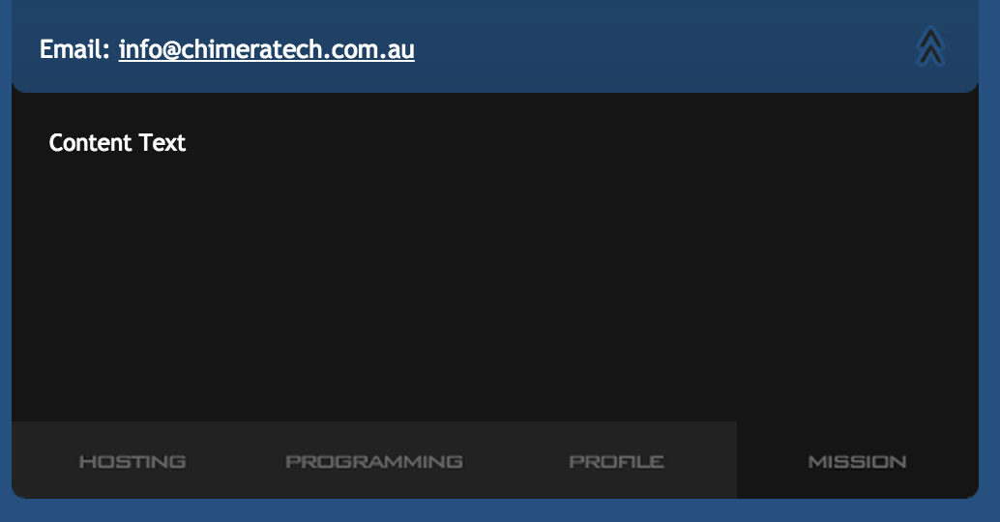

# chimeratech.com.au

## 2008

Chimera Technologies was a consulting business I started with my
friend James Meneghello. We were an eclectic arrangement of hosting,
development and general consulting on how to internet.

This is a siterip taken from a [web.archive.org] snapshot taken on
2008-07-23 20:39:18.

### Usage

As this is just static html I've chosen [Jekyll] to serve the content,
you can internet research how to get that up and running:

`jekyll server --watch --baseurl=`

If you have the [Foreman] gem installed:

`foreman start`

Ultimately it's just html, I did the ground work of setting it up with:

`python -m SimpleHTTPServer`

### Known Issues

#### Missing Content

The content within the drawers retrieved from a POST request to the
server. Not only was ajax entirely unnecessary for this purpose, as
the request was a POST the this information is now unretrievable.

[web.archive.org]: https://web.archive.org/web/20080724155452/http://chimeratech.com.au/
[Jekyll]: http://jekyllrb.com/
[Foreman]: https://github.com/ddollar/foreman
